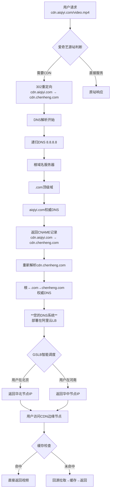
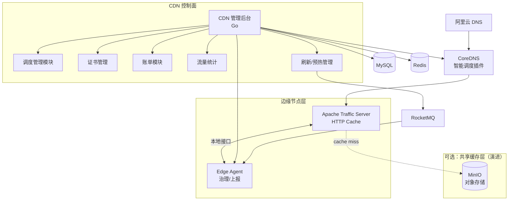
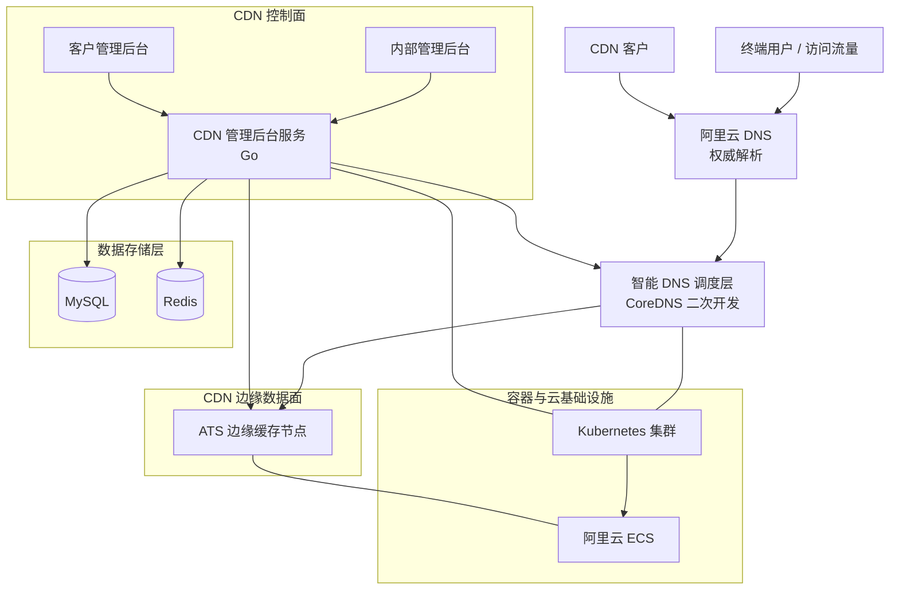
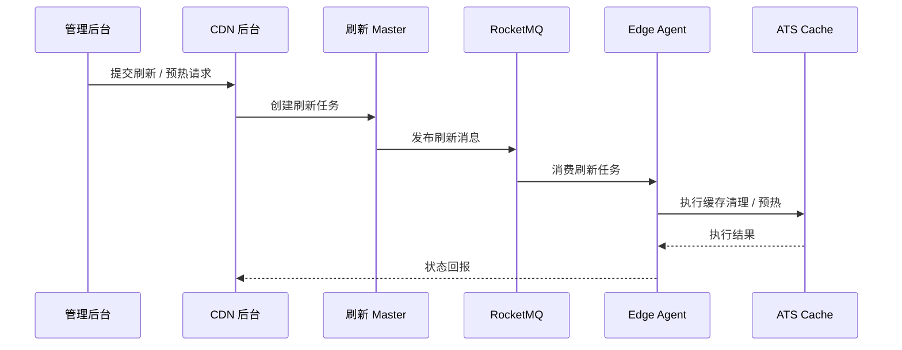
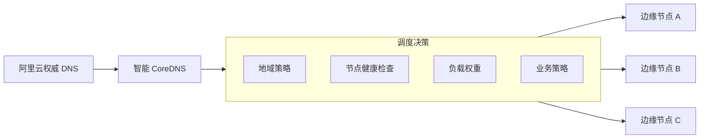

该文档把自己做过的cdn系统知识，架构整理
# 1 该系统分为几个模块，这个系统是干什么的？，架构图是什么？
## 1.1 这个系统是干什么的？
负责对接抖音，爱奇艺等客户，把他们的文件cache到我们的边缘节点，让用户访问我们的节点下载文件，以减轻对源站的下载带宽压力。
## 1.2 该系统分为几个模块？
cdn管理后台，主要负责域名管理、节点管理、调度管理、证书管理、账单模块、流量统计等核心能力建设。    
dns解析系统，二次开发k8s的coredns组件，为客户的下载文件请求解析我们公司的边缘节点的A记录IP地址，并且该dns解析服务是工作在dns权威域名服务器这一层。
## 1.3 架构图是什么？

# 2 该系统完整的工作流程是什么？从用户发起请求下载到最后完成下载文件的过程

CNAME记录的作用： 将流量从客户的域名（cdn.aiqiyi.com）引导至您公司的CDN调度系统（cdn.chenheng.com）
## 2.1 图片中重新解析 cdn.chenheng.com 这一步的理解
查询cdn.chenheng.com的权威DNS（关键步骤）： 现在，本地DNS服务器转而向管理 chenheng.com的权威DNS服务器（也就是您公司管理的DNS服务器，或者您CDN服务商提供的DNS系统）查询 cdn.chenheng.com的地址。

# 3 dns解析到结果的流程解释，每一步骤 
使用dig 模拟这个流程的各个环节每一步解析的过程和步骤
dig +trace cdn.aiqiyi.com    , 注意，域名解析的过程和中国人的习惯相反，不是从域名的左边到右边，而是根据   .   分隔符从右向左解析

## 3.1 第1步：从根域名服务器开始     
```
.			518400	IN	NS	a.root-servers.net.
.			518400	IN	NS	b.root-servers.net.
... (列出所有13个根服务器)
```
解读：DNS解析器首先查询根域名服务器（用点 .表示），询问 cdn.aiqiyi.com该找谁。根服务器告诉它，.com顶级域由哪些服务器负责（如 a.gtld-servers.net），并返回它们的IP地址。   

## 3.2 第2步：查询 .com 顶级域服务器    
```
com.		172800	IN	NS	a.gtld-servers.net.
... (从根服务器获得.com的NS记录)
```
解读：解析器接着去询问上一步得到的 .com服务器：“aiqiyi.com的权威DNS服务器是谁？” .com 服务器会返回管理 aiqiyi.com的权威DNS服务器列表。    

## 3.3 第3步：查询 aiqiyi.com的权威DNS服务器（关键步骤1）    
```
aiqiyi.com.		172800	IN	NS	ns1.aiqiyi.com.
aiqiyi.com.		172800	IN	NS	ns2.aiqiyi.com.
... (获得aiqiyi.com的权威服务器主机名)
```
解读：解析器找到了管理 aiqiyi.com的权威服务器（例如 ns1.aiqiyi.com）。接下来，它会向这些权威服务器查询 cdn.aiqiyi.com的记录。   

## 3.4 第3步的后续（关键步骤2）：获取CNAME记录
cdn.aiqiyi.com.	600	IN	CNAME	cdn.chenheng.com.
解读：这就是您问题中的记录！​ aiqiyi.com的权威服务器返回了一条CNAME记录，明确指出 cdn.aiqiyi.com只是 cdn.chenheng.com的一个别名。解析器意识到它需要重新开始查询 cdn.chenheng.com。

## 3.5 第4步：查询 chenheng.com的权威DNS服务器（回答您的问题）    
此时，解析器为了解析 cdn.chenheng.com，会重复第1到第3步的过程，但目标变成了 chenheng.com。它会：   
从根服务器找到 .com服务器。
从 .com服务器找到 chenheng.com的权威DNS服务器。    
这一步的输出会明确显示 chenheng.com的权威服务器是谁，例如：   
如果只想快速查看 chenheng.com的权威DNS服务器，而不关心完整的追踪过程，可以使用更简单的命令：dig ns chenheng.com    
```
chenheng.com.		86400	IN	NS	vip4.alidns.com.   
chenheng.com.		86400	IN	NS	vip3.alidns.com.    
vip3.alidns.com是 chenheng.com的【权威域名服务器】
```

## 3.6 第5步：获得最终IP
解析器最后向 chenheng.com的权威服务器查询 cdn.chenheng.com，并最终获得A记录（IP地址）。    
```
cdn.chenheng.com.	300	IN	A	192.0.2.1   
```

# 4 内部自研的dns系统是怎么开发部署的
## 4.1 内部自研智能dns解析系统介绍
二次开发coredns，手写一个新的插件，重写serverdns方法，最终在plugin中引入该插件，编译coredns，开发53端口，进行解析    
流量进入到serverdns时，从request中获取来源ip地址，使用内部的ip库，可以解析出该来源ip的区域（比如华北），然后调用cdn管理后台提供的rpc接口，查询该地区下部署的agent节点的活跃ip，作为A记录返回给用户     


## 4.2 dns系统是怎么部署的
部署在阿里云服务器上，购买了阿里云的公网ip作为入口，k8s上使用loadblance的service部署方式，轮训机制，   
没有使用clusterip，因为这个只能k8s集群内部调用，   
没有使用nodeport方式，这个的端口限制必须是大于30000，而我们的dns默认端口是53，不方便用户使用    

# 5 系统架构图
架构描述：   

我们整体采用 DNS 调度 + 边缘缓存的 CDN 架构。
流量首先通过阿里云权威 DNS 进入，在内部通过二次开发的 CoreDNS 实现智能调度，根据节点健康、地域、策略返回最优边缘节点。

控制面基于 Go 实现，负责域名、节点、调度、证书、账单、统计等管理能力，数据存储使用 MySQL + Redis。

刷新与预热采用 Master + RocketMQ 的方式进行异步任务分发，边缘节点通过 Agent 消费任务并操作本地 ats Cache。

整体系统基于 Docker 容器化，通过 Kubernetes 统一部署，运行在阿里云 ECS 之上，具备良好的扩展性和稳定性。   
# 5.1 系统总体结构图

# 5.1  整体系统分层视图

# 5.2 刷新 / 预热链路细化图 


# 5.3 DNS 调度逻辑视图


# 6 思考
## 6.1 为什么缓存文件在ats中，而不是nginx的cache中 ？
缓存文件  不放在  Nginx 本地磁盘里的原因： 因为 Nginx 的 cache 目录增长难控、inode 爆炸、清理不灵活。     
选择ats的考量：   

Apache Traffic Server (ATS)，出身大流量 Web Cache
支持磁盘 + 内存双级缓存       
更成熟的存储管理和淘汰机制       
可以作为大型 CDN 的边缘缓存引擎       
ATS 在 CDN 场景中比 Varnish 更稳定、可扩展       
适合高并发、大文件场景         

## 6.2 只使用ats做热缓存，不使用Minio作为温缓存的原因是什么？

规模小不需要使用minio，如果后续规模大，就要使用Minio，可以减少回源次数。   
ATS 本身就是一个成熟的边缘缓存系统，可以独立承担缓存职责。    
我们在设计时并没有一开始就引入对象存储，而是优先保证边缘节点的简单性和稳定性。     
在流量规模扩大、回源成本和跨节点缓存复用成为瓶颈后，才会引入 MinIO 作为共享缓存层，用于热点内容复用和冷热分层。   
MinIO 不是边缘节点,部署在中心机房，网络延迟远高于边缘 ATS，客户访问的永远只能是ATS。    
```
Client
  ↓
ATS（边缘缓存）
  ↓ cache miss
MinIO（共享缓存池 / 温数据）
  ↓ miss
源站

```
